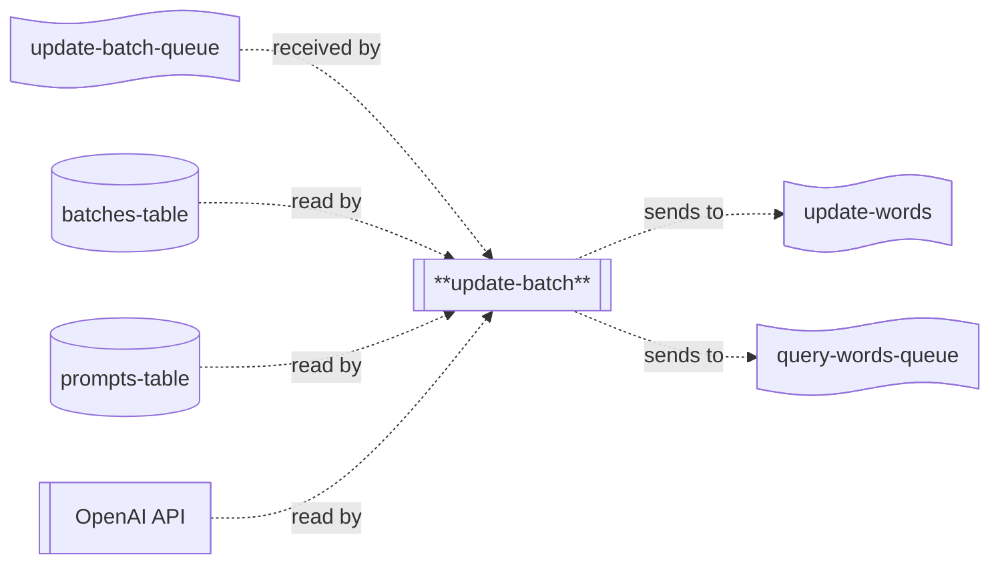

# update-batch

## Description

This repo contains the source code for the `update-batch` lambda, which is part of the Word List application's backend processing chain for updating word scores.



When the `update-batch` lambda runs, it receives a message containing information about the batch which needs to be updated.  The LLM responses for the batch are fetched and compared against the prompts requested.  Any missing or invalid words/scores are re-requested by sending a message to the target `query-words-queue`.  Any words that were both requested and have a valid score are send as messages to the target `update-words-queue` to be batch updated.

## Environment Variables

The lambda uses the following environment variables:

| Variable Name           | Description                                         |
|-------------------------|-----------------------------------------------------|
| BATCHES_TABLE_NAME      | Name of the table batch information is stored in.   |
| PROMPTS_TABLE_NAME      | Name of the table prompt information is stored in.  |
| OPENAI_API_KEY          | API key for accessing the OpenAI API.               |
| UPDATE_WORDS_QUEUE_NAME | Name of the queue to send update batch messages to. |
| QUERY_WORDS_QUEUE_NAME  | Name of the queue to send query words messages to.  |

## Common Packages

This project uses the `WordList.Common` shared library (in the `lib-common` repository) which is published on GitHub.  To be able to import it, you'll need to use the following command:

```
dotnet nuget add source --username <your-username> --password <github-PAT> --store-password-in-clear-text --name github "https://nuget.pkg.github.com/word-list/index.json"
```